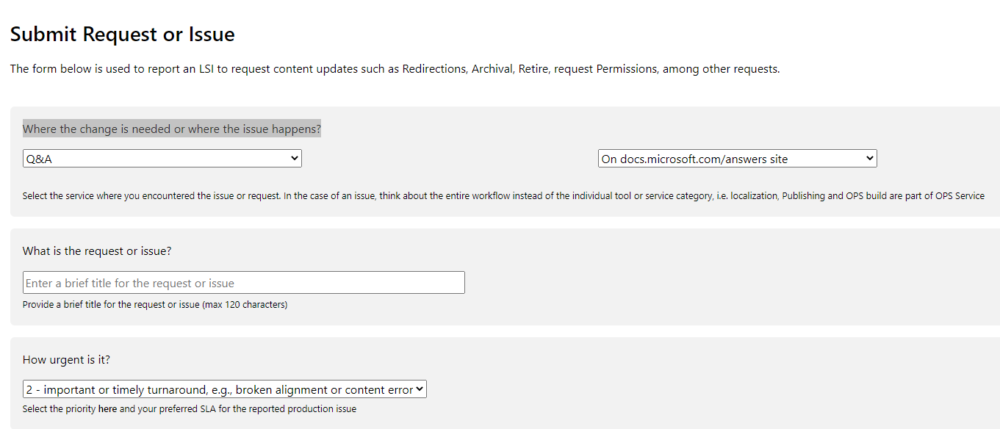

# Reporting issues or improvements for Microsoft Q&A

Please use [SiteHelp](https://sitehelp.microsoft.com/new?fid=49) to report any issues or requests regarding Microsoft Q&A. This will ensure the issue gets routed to the right team and we can maintain our SLAs for live site incidents. 

> [!IMPORTANT]
> Once you submit the ticket in SiteHelp, you will get a link to the corresponding ticket found. All the conversations, request for status, etc. should be done within that ticket.

## How to file a ticket via SiteHelp

## Platform issues

**Escalation contact:** Aman Singh.

> [!TIP]
> See our [Q&A SLA](https://review.docs.microsoft.com/en-us/sre/qnasla?branch=master) for more info on what issues qualify for this category and their severity.

1. Go to [SiteHelp](https://sitehelp.microsoft.com/new?fid=49) and select **"Q&A"** under *Where the change is needed or where the issue happens?* section.
1. Select **Production Issues on docs.microsoft.com/answers site** under *Select Service Category* for any live site incidents, such as site is down, performing badly, cannot post, etc.
1. Enter a brief title of the issue.
1. Select the severity.
1. Provide as many details as possible of the issue.
1. Click **Submit**.

## Issues on PPE

**Escalation contacts:** Aman Singh and Sandra Aldana

There will be sometimes you are in our PPE environment doing some testing or testing a new feature that is not yet released yet. In those cases, you use this category. 

1. Go to [SiteHelp](https://sitehelp.microsoft.com/new?fid=49) and select **"Q&A"** under *Where the change is needed or where the issue happens?* section.
1. Under *Select Service Category*, select **Pre-production issues on ppe.docs.microsoft.com/answers site**.
1. Enter a brief title of the issue.
1. Add any additional tags you think are pertinent. Please do not remove the existing tags.
1. Attach a file describing your issue
1. Provide as many details as possible of the issue.
1. Click **Submit**.

## Bugs

**Escalation contact:** Sandra Aldana

This option is for bugs on existing functionality, such as broken links, an option is missing, number of following items do not appear on the site, etc.

1. Go to [SiteHelp](https://sitehelp.microsoft.com/new?fid=49) and select **"Q&A"** under *Where the change is needed or where the issue happens?* section.
1. Under *Select Service Category*, select **Bug**.
1. Enter a brief title of the issue.
1. Add any additional tags you think are pertinent. Please do not remove the existing tags.
1. Attach a file describing your issue.
1. Provide as many details as possible of the issue.
1. Click **Submit**.

## Feature requests

This option is for functionality that do not exist today that you wish it existed, such as tag synonyms, site notifications, etc.

1. Go to [SiteHelp](https://sitehelp.microsoft.com/new?fid=49) and select **"Q&A"** under *Where the change is needed or where the issue happens?* section.
1. Under *Select Service Category*, select **Feature Request**.
1. Enter a brief title of the new functionality.
1. Add any additional tags you think are pertinent. Please do not remove the existing tags.
1. Attach a file showing a mockup or how another site is solving this problem.
1. Provide as many details as possible of what you want and why.
1. Click **Submit**.

## Permission requests

**Escalation contact:** Sandra Aldana

By default, any user creating a profile will have basic functionality in Microsoft Q&A such as ask a question, answer, add comments, etc. However, some users might need additional permisions. So use this option if you think you need to be added to any of the following group:

1. Go to [SiteHelp](https://sitehelp.microsoft.com/new?fid=49) and select **"Q&A"** under *Where the change is needed or where the issue happens?* section.
1. *Azure CXP Moderator* - If you are part of the Azure CXP team.
1. *CSS Moderators* - If you are part of the CSS team.
1. *Microsoft Moderators* - If you want to be a moderator and are not in the Azure CXP or CSS group.
1. *Product Group* - If you are part of a Product Group.

> [!TIP]
> For any other permission requests, please contact [Sandra Aldana](mailto:saldana).

**Steps**:

1. Under *Select Service Category*, select **Site Permissions**.
1. Enter in the title which group you want to be added.
1. Add any additional tags you think are pertinent. Please do not remove the existing tags.
1. Provide the details asked in the "Tell us more" section.
1. Click **Submit**.
